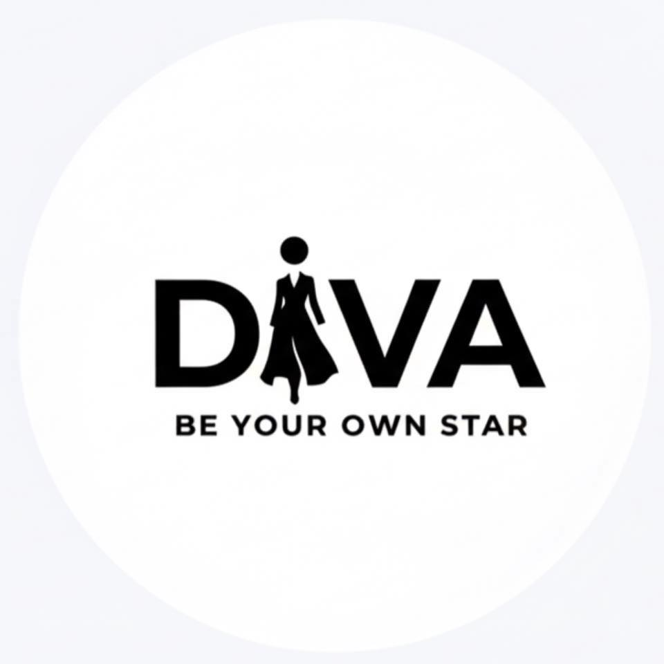

# موقع DIVA - محل ملابس حريمي

## 📝 نبذة عن الموقع

موقع ويب حديث وبسيط لمحل DIVA للملابس الحريمية. يوفر الموقع معلومات عن المحل والعروض المتاحة وطريقة الاتصال مع خريطة الموقع.

## ✨ المميزات

- ✅ تصميم متجاوب (Responsive) - يعمل على جميع الأجهزة
- ✅ ألوان أسود وأبيض احترافية
- ✅ صفحات متعددة (الرئيسية، عن المحل، العروض، الاتصال، السياسة)
- ✅ خريطة تفاعلية لموقع المحل
- ✅ نماذج تواصل وتسجيل في النشرة البريدية
- ✅ أنيميشنات وتأثيرات بصرية جميلة
- ✅ قائمة تنقل سهلة الاستخدام
- ✅ زر الرجوع للأعلى (Scroll to Top)

## 📂 هيكل الملفات

```
public/
├── index.html           # الصفحة الرئيسية
├── about.html           # صفحة عن المحل
├── offers.html          # صفحة العروض
├── contact.html         # صفحة الاتصال مع الخريطة
├── privacy.html         # سياسة الخصوصية
├── styles.css           # ملف الأنماط
└── script.js            # ملف JavaScript
```

## 🚀 كيفية الاستخدام

### تشغيل الموقع

1. **طريقة مباشرة:**
   - فتح ملف `index.html` مباشرة في المتصفح

2. **باستخدام خادم محلي (الأفضل):**
   ```bash
   # إذا كان لديك Python
   python -m http.server 8000
   
   # أو إذا كان لديك Node.js
   npx http-server
   ```
   ثم زيارة `http://localhost:8000`

### تخصيص الموقع

#### إضافة اللوجو
1. ضع صورة اللوجو في مجلد `public` واسمها `logo.png`
2. أضف هذا الكود في ملف `index.html` (وكل الملفات الأخرى) بدل `<span class="logo-text">DIVA</span>`:

```html

```

#### تعديل المعلومات
- **معلومات المحل:** عدّل في `contact.html` في قسم `contact-info`
- **ساعات العمل:** غيّر في `contact.html`
- **رقم الهاتف والبريد:** أضفهما في جميع الصفحات حسب الحاجة
- **موقع الخريطة:** عدّل الإحداثيات في `contact.html` (`setView([30.0444, 31.2357], 13)`)

#### تعديل الألوان
في ملف `styles.css`، عدّل المتغيرات التالية:

```css
:root {
    --primary-color: #000;      /* اللون الأساسي */
    --secondary-color: #fff;    /* اللون الثانوي */
    --accent-color: #333;       /* لون التمييز */
    --text-dark: #000;          /* لون النص الداكن */
    --text-light: #fff;         /* لون النص الفاتح */
}
```

## 📱 التوافق

- ✅ أجهزة الحاسوب (Desktop)
- ✅ الأجهزة اللوحية (Tablet)
- ✅ الهواتف الذكية (Mobile)
- ✅ جميع المتصفحات الحديثة

## 🎨 تحسينات مستقبلية

يمكنك إضافة:
- صور المنتجات
- نظام تصفية العروض
- تقييمات العملاء
- مدونة للنصائح والموضة
- تكامل مع وسائل التواصل الاجتماعي
- نموذج حجز موعد

## 📧 الدعم والمساعدة

لأي استفسارات أو تعديلات مستقبلية:
- البريد: divastor0@gmail.com
- الهاتف: 01142640064

---

**ملاحظة:** جميع البيانات في النماذج محفوظة محلياً. لحفظ البيانات فعلياً، ستحتاج إلى ربط الموقع بقاعدة بيانات (Database) أو خدمة ويب.

